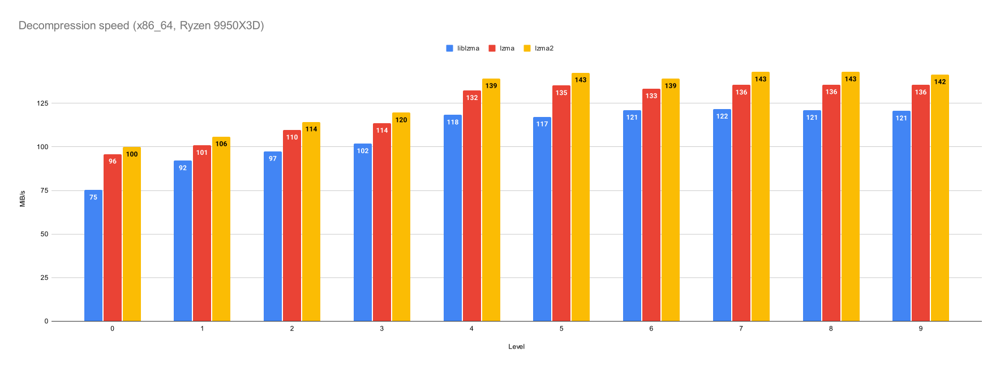
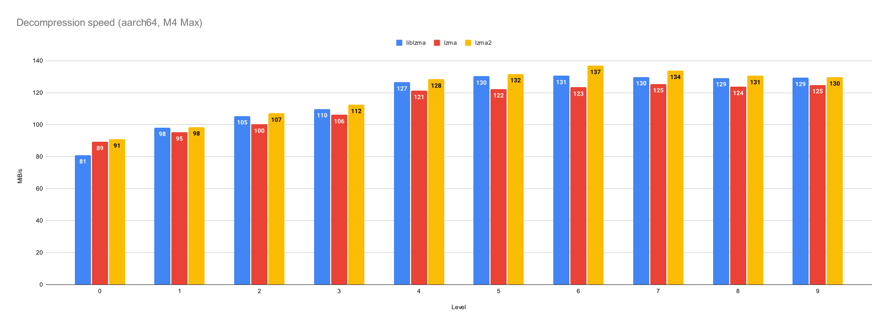
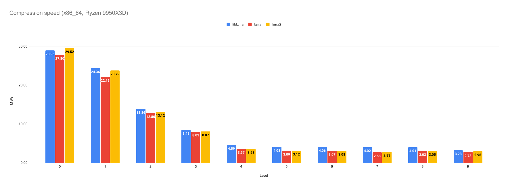
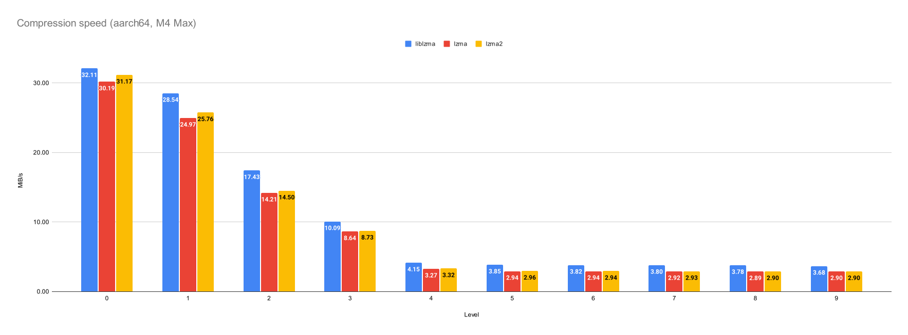

# LZMA / LZMA2 in native Rust

LZMA/LZMA2 codec ported from [tukaani xz for java](https://tukaani.org/xz/java.html).

This is a fork of the original, unmaintained lzma-rust crate to continue the development and maintenance.

## Safety

Only the `optimization` feature uses unsafe Rust features to implement optimizations, that are
not possible in safe Rust. Those optimizations are properly guarded with assertions and are of
course sound. The include creation of aligned memory, handwritten assembly code for hot
functions and some pointer logic. Those optimization are well localized and generally consider
safe to use, even with untrusted input.

Deactivating the `optimization` feature will result in 100% standard Rust code.

## Performance

The following part is strictly about single threaded performance. This crate doesn't expose a multithreaded API yet
to support compression or decompressing LZMA2's chunked stream in parallel yet.

When compared against the `liblzma` crate, which uses the C library of the same name, this crate has improved decoding
speed when using LZMA2 (aarch64 and x86_64) and LZMA (x86_64). We provide diagrams for both aarch64 (M4 Max) and
x86_64 (Ryzen 9950X3D) to compare the different compression levels.

Encoding hasn't been optimized yet and is in general slower. At worst 25% on aarch64 and 29% on x86_64. We provide
diagrams for both aarch64 (M4 Max) and x86_64 (Ryzen 9950X3D) to compare the different compression levels.

Data was assembled using lzma-rust2 v0.3.0 and liblzma v0.4.2.

## License

Licensed under the [Apache License, Version 2.0](https://www.apache.org/licenses/LICENSE-2.0).
